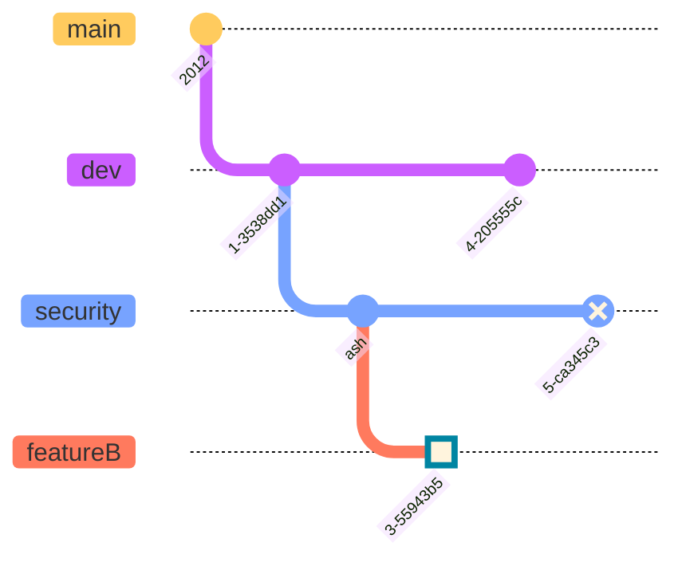
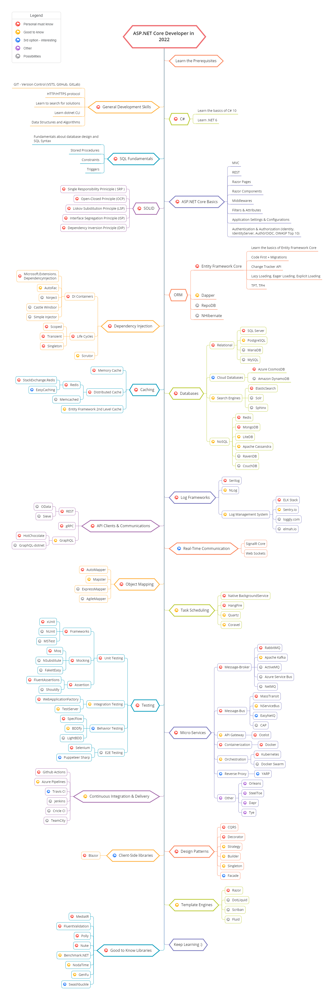

```mermaid
%%{init: { 'theme': 'base' } }%%
      gitGraph
        %% direction LR
        commit id:"2012"
        branch dev
        checkout dev
        commit
        branch security
        checkout security
        commit id:"ash"
        branch featureB
        checkout featureB
        commit type:HIGHLIGHT
        checkout main
        checkout dev
        commit type:NORMAL
        checkout security
        commit type:REVERSE
        checkout featureB
```

